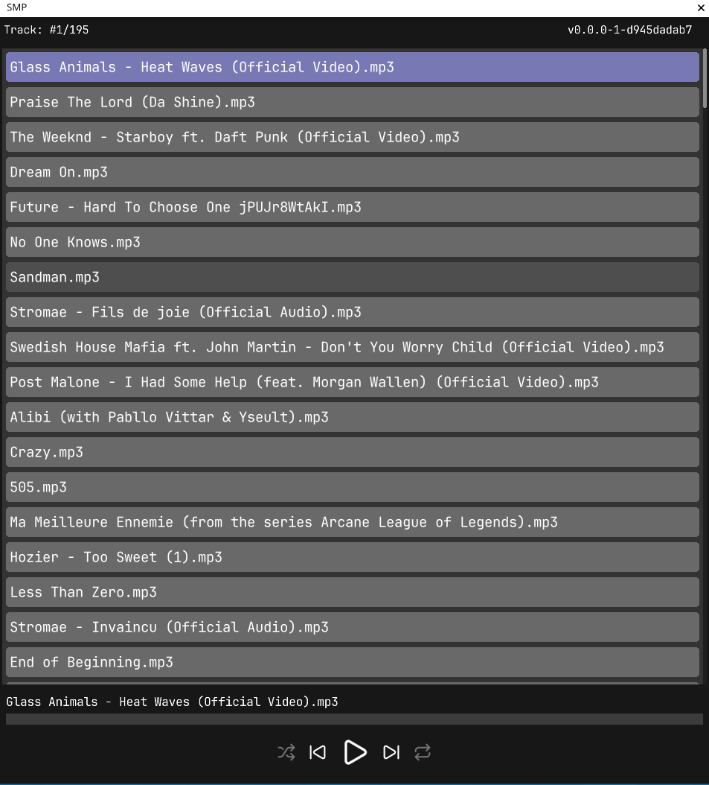

# SMP

Simple Music Player
This is my attempt at a music player that does that and only that.

## TODO:
- [x] Quit the window
- [x] Read from dir
- [x] Load music
- [x] Play Music
- [x] Keybinds for next/prev play/pause
- [x] Seek forwards/back
- [x] Shuffle
- [X] Repeat(Single/All/None)
- [ ] Cosmetic things

I make alot of assumptions:
- Your Music is n `$HOME/Music`
- Most of your audio is in raylib's supported format:
    - wav
    - mp3
    - ogg
- You are comfortable with the keyboard.

## Usage
Requirements:
 - Odin compiler

1. Bootstrap*
```sh
odin build first -out:first.bin
```

2. Build
```sh
./first.bin release
```

3. Use
```sh
./smp
```

or copy the generated smp.desktop from resources to `~/.local/share/applications/`
to allow starting it from your favorite launcher

3.1.
```sh
cp ./resources/smp.desktop ~/.local/share/application/
```


## Controls

| Key         | Action                      |
| ---         | ---                         |
| SPACE       | play/pause                  |
| N           | Next track                  |
| P           | Previous track              |
| S           | Toggle Shuffle              |
| R           | Cycle between repeat modes  |
| ARROW_RIGHT | Seek forward by 5 seconds   |
| ARROW_LEFT  | Seek backwards by 5 seconds |



