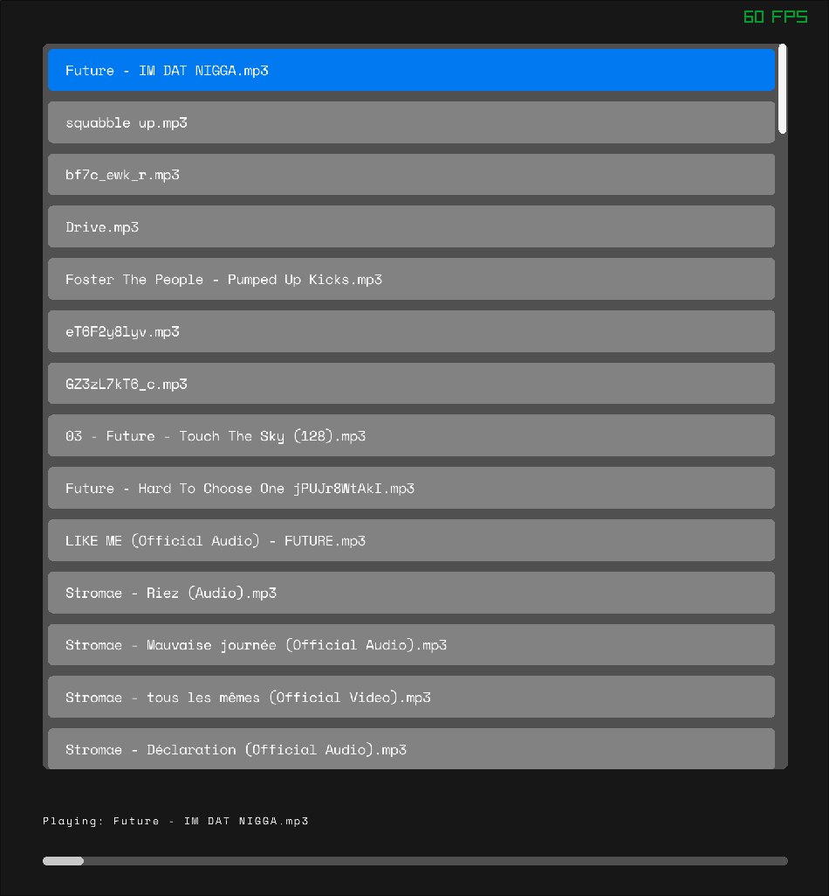

# SMP

Simple Music Player
This is my attempt at a music player that does that and only that.

## TODO:
- [x] Quit the window
- [x] Read from dir
- [x] Load music
- [x] Play Music
- [x] Keybinds for next/prev play/pause
- [x] Seek forwards/back
- [ ] Cosmetic things

Lets see how far we can get
Seems we've gotten quite far.

I make alot of assumptions:
- You are on a `*nix` system.
- Your Music is n `~/Music`
- Most of your audio is in raylib's supported format:
    - wav
    - mp3
    - ogg
> Flac needs raylib built to support it, didn't do that
- You are comfortable with the keyboard.

## Controls

| Key         | Action                       |
| ---         | ---                          |
| SPACE       | play/pause                   |
| N           | Next track                   |
| P           | Previous track               |
| ARROW_RIGHT | Seek forward by 10 seconds   |
| ARROW_LEFT  | Seek backwards by 10 seconds |

